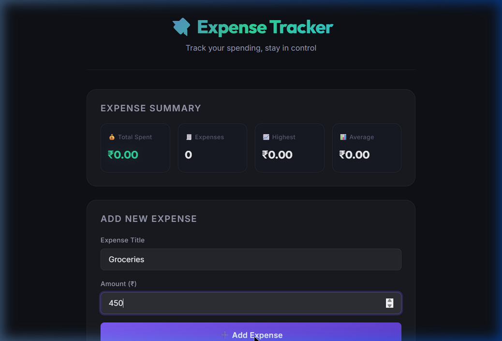
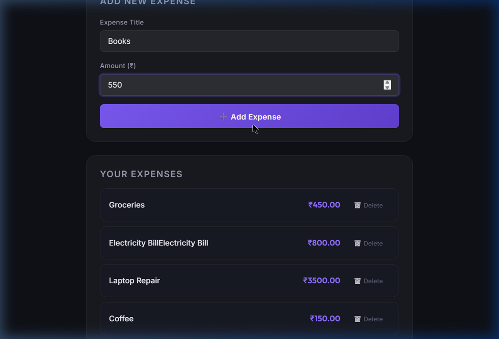

# React Expense Tracker

A simple Expense Tracker application built with React and Vite. It allows you to track daily expenses with real-time calculations and saves your data locally in the browser.




## Features

- Add and delete expenses (title and amount)
- Calculates total spent, total number of expenses, highest expense, and average expense
- The total amount turns green when under budget (<= 1000) and red when over budget (> 1000)
- Data persists across page reloads using browser localStorage
- Responsive UI with dark mode support

## Technologies Used

- React 19
- Vite
- Vanilla CSS
- Google Fonts (Inter, Outfit)

## Setup and Installation

Make sure you have Node.js installed.

1. Clone the repository:
```bash
git clone https://github.com/rousxansingh04/Expense-tracker.git
cd Expense-tracker
```

2. Install dependencies:
```bash
npm install
```

3. Run the development server:
```bash
npm run dev
```

4. Open your browser and visit `http://localhost:5173/`.

## React Concepts Covered

This project demonstrates several core React principles:
- Functional Components and JSX
- State management with `useState`
- Side effects and localStorage synchronization with `useEffect`
- Passing props and lifting state up
- List rendering using `.map()` and keys
- Conditional rendering
